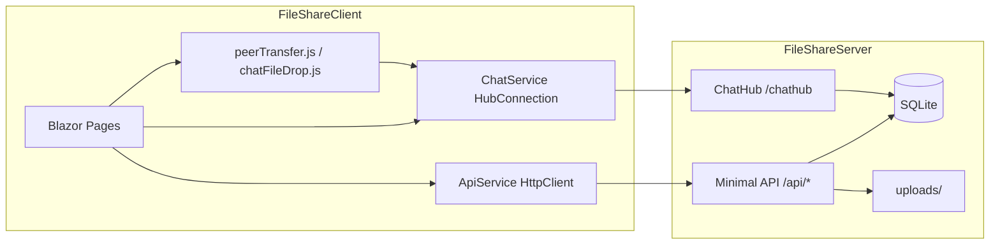
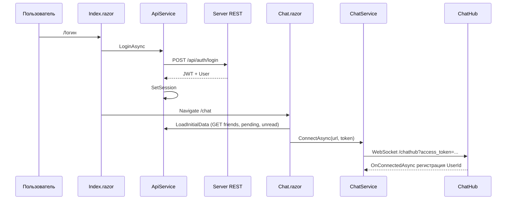
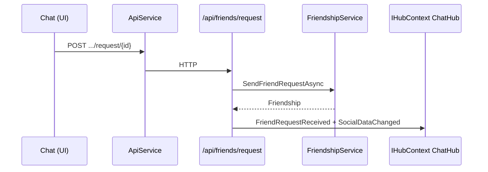
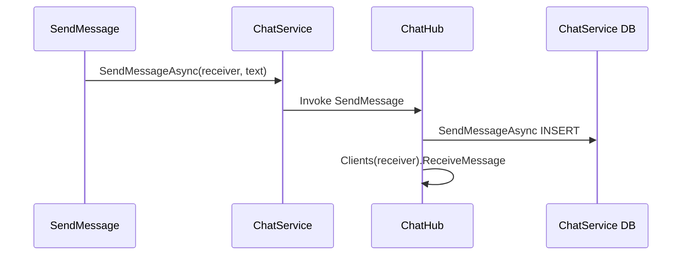
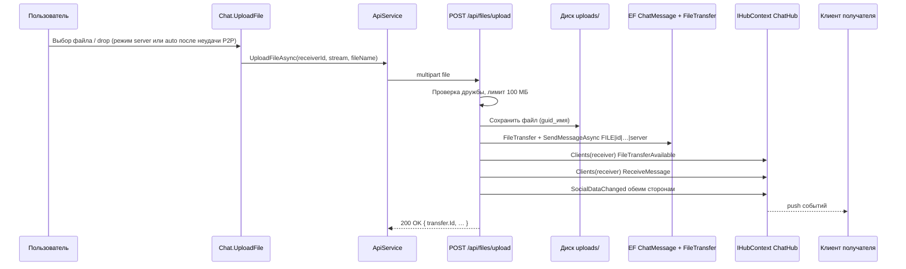
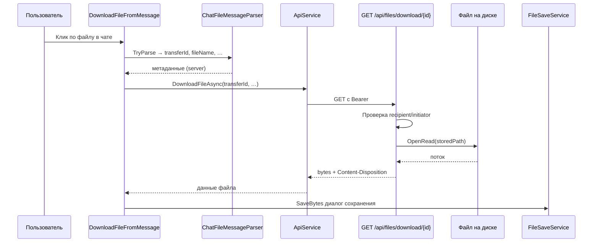
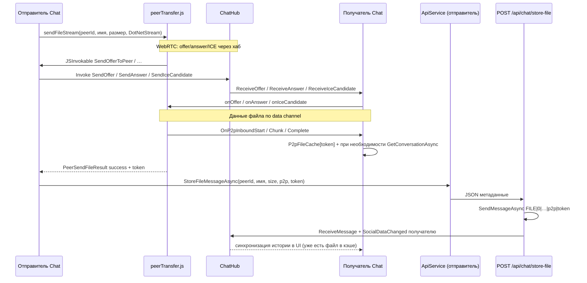
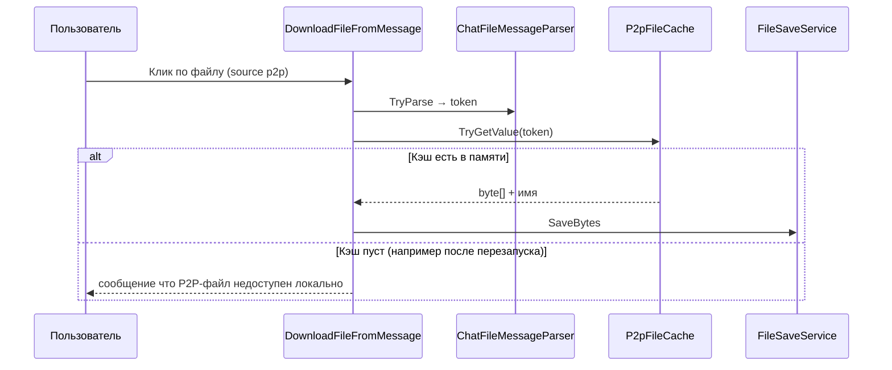

# FileExchange / FileShare: полный жизненный цикл и архитектура

Документ описывает цепочки вызовов в текущей кодовой базе: **FileShareClient** (Windows Forms + Blazor WebView) и **FileShareServer** (ASP.NET Core, Minimal API, SignalR, SQLite). Базовый URL API в клиенте задаётся в `ApiService.ServerUrl` (по умолчанию указывает на развёрнутый сервер; для локальной отладки замените на свой хост).

---

## 1. Высокоуровневая схема

| Слой | Технологии | Роль |
|------|------------|------|
| Клиент UI | Blazor (страницы `Index`, `Chat`), JS (`peerTransfer`, `chatFileDrop`) | Ввод данных, отображение чата, P2P (WebRTC) |
| Клиент сеть | `HttpClient` в `ApiService`, `HubConnection` в `ChatService` | REST + SignalR |
| Сервер HTTP | Minimal API, группа `/api/...`, JWT Bearer | Регистрация, пользователи, друзья, чат (часть операций), файлы |
| Сервер realtime | `ChatHub` на маршруте `/chathub` | Сообщения в реальном времени, presence, WebRTC-сигналинг, уведомления |
| Данные | EF Core + SQLite (`fileshare.db`), папка `uploads/` на сервере | Пользователи, дружба, сообщения, метаданные файлов |

---

## 2. Запуск клиента и внедрение зависимостей

1. **Точка входа:** `FileShareClient/Program.cs` — `Main()` создаёт `ServiceCollection`, регистрирует:
   - `ApiService` (Scoped)
   - `ChatService` (Scoped)
   - `FileSaveService` (Scoped)
   - `WindowControlService` (Singleton)
2. Открывается `MainForm` с `BlazorWebView`, корневой компонент — `App.razor` (`Router` без явного layout по умолчанию).
3. Маршруты страниц: `@page "/"` → `Index.razor` (логин/регистрация); `@page "/chat"` → `Chat.razor` + partial-классы в `Pages/Chat/`.

---

## 3. Регистрация и вход (JWT + сессия в памяти клиента)

### 3.1. Регистрация

| Шаг | Где | Что происходит |
|-----|-----|----------------|
| 1 | `Index.razor` → `HandleRegister()` | Валидация полей, минимум 6 символов пароля. |
| 2 | `ApiService.RegisterAsync(...)` | `POST {ServerUrl}/api/auth/register` с JSON `{ username, email, password }`. |
| 3 | Сервер | `AuthEndpointExtensions`: эндпоинт группы `api.MapGroup("/api").MapGroup("/auth")` → `POST /register` ⇒ полный путь **`POST /api/auth/register`**. |
| 4 | `AuthService.RegisterAsync` | Проверка уникальности `Username`, создание `User` с `BCrypt` хэшем пароля, `SaveChangesAsync`. |
| 5 | `AuthService.GenerateJwtToken` | JWT с claims `NameIdentifier` (Id пользователя), `Name`, `Email`; срок ~24 ч. |
| 6 | Ответ | `200 OK` + `AuthResponseDto` (`Token`, `UserDetailDto`). При дубликате имени — `400` с текстом из констант. |
| 7 | Клиент | При успехе: `ApiService.SetSession(token, user)` — выставляет `Authorization: Bearer …` на `HttpClient` и `CurrentUser`. |
| 8 | Навигация | `Navigation.NavigateTo("/chat")`. |

### 3.2. Вход

| Шаг | Где | Что происходит |
|-----|-----|----------------|
| 1 | `Index.razor` → `HandleLogin()` | Валидация полей. |
| 2 | `ApiService.LoginAsync` | **`POST /api/auth/login`** с `{ username, password }`. |
| 3 | `AuthService.LoginAsync` | Поиск пользователя, `BCrypt.Verify`, выпуск JWT. |
| 4 | Ответ | `200 OK` + токен и пользователь; при ошибке — `401`. |
| 5 | Клиент | `SetSession` → переход на `/chat`. |

Эндпоинты `/api/auth/*` **не** помечены `.RequireAuthorization()` — это публичные маршруты.

### 3.3. Защищённые REST-вызовы после входа

В `ServiceExtensions.AddApplicationAuthentication`:

- Схема **JWT Bearer**; ключ из `Jwt:Secret` в конфигурации.
- Обработчик `OnMessageReceived`: если в запросе есть query-параметр `access_token`, он подставляется как токен (это нужно для **SignalR**, см. ниже).

Идентификатор текущего пользователя в Minimal API извлекается через **`HttpContext.GetUserId()`** (`HttpContextExtensions`) из claim `ClaimTypes.NameIdentifier`.

---

## 4. Страница чата: инициализация и SignalR

Файл: `Chat.razor.cs`, метод `OnInitializedAsync`.

| Шаг | Вызов | Назначение |
|-----|--------|------------|
| 1 | Проверка `ApiService.IsAuthenticated` | Иначе редирект на `/`. |
| 2 | `CurrentUser = ApiService.CurrentUser` | Локальное состояние UI. |
| 3 | `LoadInitialData()` (`Chat.Friends.cs`) | REST: `GetFriendsAsync`, `GetPendingRequestsAsync`, `GetSentRequestsAsync`, `RefreshUnreadCounts` → `GetUnreadMessagesAsync`. |
| 4 | Подписки на события `ChatService` | `OnMessageReceived`, `OnUserOnline`/`Offline`, `OnSocialDataChanged`, P2P/WebRTC, `OnFriendRequestReceived`, `OnFileTransferAvailable`, `OnConnected`, `OnConnectionStateChanged`. |
| 5 | `ChatService.ConnectAsync(ServerUrl, Token)` | Создаётся `HubConnection` на **`{ServerUrl}/chathub?access_token={token}`** (токен в query — сервер читает его в JWT middleware для WebSocket). |

### 4.1. Сервер: подключение к хабу

`ChatHub.OnConnectedAsync`:

1. Читает `access_token` из query.
2. `AuthService.GetUserIdFromToken(token)` — валидация JWT без полного pipeline (своя `TokenValidationParameters` в `AuthService`).
3. `UserConnectionManager.AddConnection(userId, connectionId)` — учёт всех вкладок/соединений; если пользователь «впервые» онлайн — флаг возвращается как `becameOnline`.
4. При первом подключении: `UserService.SetUserOnlineAsync`.
5. Друзьям рассылается **`UserOnline`** (и вызывающему — информация о уже онлайн друзьях).

`OnDisconnectedAsync`: удаление connection id, при последнем соединении — `SetUserOfflineAsync`, друзьям **`UserOffline`**.

### 4.2. Клиент: обработчики хаба

Файл: `FileShareClient/Services/ChatService.cs` — регистрация `On<...>("ReceiveMessage", …)` и т.д. Имена методов на сервере должны совпадать с константами в `AppConstants.HubMethods` там, где они используются из C# сервера; часть вызовов из `ChatHub` идёт строковыми литералами (`"ReceiveMessage"`, `"UserOnline"`, …) — на клиенте зеркально.

---

## 5. Социальный граф: поиск пользователей и заявки в друзья

### 5.1. Загрузка списков (REST)

Все под **`/api/friends/...`** и **`/api/users/...`** с **`.RequireAuthorization()`** — нужен заголовок `Authorization: Bearer`.

| Операция | Клиент (`ApiService`) | Сервер |
|----------|----------------------|--------|
| Список друзей | `GET /api/friends/list` | `FriendshipEndpointExtensions` → `FriendshipService.GetFriendsAsync` + `IsOnline` из `UserConnectionManager`. |
| Входящие заявки | `GET /api/friends/pending` | Заявки, где текущий пользователь — получатель (`FriendshipRequestDto`). |
| Исходящие | `GET /api/friends/sent` | Отправленные ожидающие заявки. |
| Поиск | `GET /api/users/search/{query}` | `UserService.SearchUsersAsync`, из результата исключается текущий пользователь (`GetUserId`). |

Дополнительно: `GET /api/users` и `GET /api/users/{id}` — полный список / карточка (для админ-сценариев или расширений).

### 5.2. Отправка заявки в друзья

**UI:** `Chat.Friends.cs` → `SendFriendRequest(userId)` (и дублирующая логика в `MainLayout.razor` для старого layout, если используется).

**Цепочка:**

1. `ApiService.SendFriendRequestAsync(friendId)` → **`POST /api/friends/request/{friendId}`** (тело пустое).
2. Сервер: `httpContext.GetUserId()` → `FriendshipService.SendFriendRequestAsync(userId, friendId)` — правила в БД (не сам себе, нет дубликата pending/accepted, rejected можно переоткрыть).
3. При успехе сервер через **`IHubContext<ChatHub>`**:
   - всем connection id **получателя**: `SocialDataChanged`, **`FriendRequestReceived`** `{ SenderId, SenderName }`;
   - отправителю и получателю: `SocialDataChanged` (обновить бейджи/списки).

**Клиент:** обработчик `HandleFriendRequestReceived` в `Chat.RealtimeHandlers.cs` обновляет статусную строку; полное обновление данных часто идёт через `SocialDataChanged` → `HandleSocialDataChanged` → `LoadInitialData()` и при открытом чате перезагрузка `GetConversationAsync`.

### 5.3. Принятие / отклонение / удаление

- **`POST /api/friends/accept/{friendId}`** — `AcceptFriendRequestAsync`; уведомления `SocialDataChanged` обоим.
- **`POST /api/friends/reject/{friendId}`** — аналогично.
- **`DELETE /api/friends/remove/{friendId}`** — `RemoveFriendAsync`.

Везде после изменений — рассылка **`SocialDataChanged`** активным соединениям сторон.

---

## 6. Текстовые сообщения: три пути (P2P, SignalR, REST-догон)

### 6.1. Отправка из UI

`Chat.Messaging.cs` → `SendMessage()`:

1. Проверки: не пустой ввод, выбран друг из актуального списка `Friends`, `ChatService.IsConnected` для не-P2P путей.
2. **Если друг онлайн:** попытка **`JS.InvokeAsync<bool>("peerTransfer.sendText", friendId, content)`** — доставка по WebRTC data channel (сигналинг через хаб, см. §7).
3. **Если P2P вернул `true`:** фоном **`ApiService.StoreMessageAsync`** → **`POST /api/chat/store/{friendId}`** с `{ content }` — запись в БД без push через хаб в этом же методе (история на сервере).
4. **Если P2P не сработал или друг офлайн:** **`ChatService.SendMessageAsync(receiverId, content)`** → `HubConnection.InvokeAsync("SendMessage", receiverId, content)`.

### 6.2. Сервер: хаб `SendMessage`

`ChatHub.SendMessage`:

1. `senderId` из `Context.Items["UserId"]` (установлено в `OnConnectedAsync`).
2. `FriendshipService.AreFriendsAsync` — иначе тихий выход.
3. `ChatService.SendMessageAsync` — INSERT в `ChatMessages` (тип Text).
4. Каждому `connectionId` получателя: **`ReceiveMessage`** с объектом `{ Id, SenderId, SenderName, Content, Timestamp, Type }`.

### 6.3. REST: только сохранение (без хаба в этом handler)

**`POST /api/chat/store/{friendId}`** (`ChatEndpointExtensions`):

- Проверка дружбы, непустой `content`.
- `ChatService.SendMessageAsync` — сообщение в БД.
- Ответ `Ok` с полями сообщения; **в этом эндпоинте нет** вызова `Clients.SendAsync("ReceiveMessage")` — push идёт только из хаба или из других мест (файлы).

Использование: догон истории после P2P-текста и потенциально другие сценарии.

### 6.4. Получение на клиенте

- **SignalR:** `ChatService` поднимает `OnMessageReceived` с десериализацией в `ChatMessage`.
- **`Chat.RealtimeHandlers.HandleMessageReceived`:** если открыт чат с отправителем — добавление в `Messages`, `MarkSingleMessageAsRead`; иначе инкремент `UnreadCounts`. Также вызывается `LoadInitialData()` для синхронизации списков.
- **P2P текст:** `Chat.FileTransfer.Peer.cs` → `[JSInvokable] OnPeerTextMessage` — добавление в UI или счётчик непрочитанных (без автоматического REST `mark-read` для этого пути в том же фрагменте).

### 6.5. Загрузка истории и прочитанность

- **`GET /api/chat/conversation/{friendId}`** — только если друзья; иначе пустой список.
- **`GET /api/chat/unread`** — непрочитанные для текущего пользователя.
- **`POST /api/chat/mark-read/{messageId}`** — вызывается из клиента при открытии диалога (`MarkFriendMessagesAsRead`) и при получении сообщения в открытом чате.

---

## 7. Файлы: режим SERVER, P2P и скачивание

### 7.1. Режим отправки (`FileSendMode` в `Chat`)

- **`server`** — только загрузка на сервер (лимит **100 МБ** на клиенте и на сервере).
- **`p2p`** — только прямой канал; при неудаче — ошибка без fallback.
- **`auto`** — сначала P2P (`peerTransfer.sendFileStream`), при неудаче — fallback на `UploadFileAsync`, если файл ≤ 100 МБ.

Общая логика: `Chat.FileTransfer.Upload.cs` → `UploadFile(stream, fileName)`.

### 7.2. SERVER: загрузка и уведомления

1. **`ApiService.UploadFileAsync`** — `multipart/form-data`, поле `file` → **`POST /api/files/upload/{receiverId}`**.
2. Сервер (`FileEndpointExtensions`):
   - проверка дружбы, размера, запись файла в **`uploads/{guid}_{originalName}`** (имя хранится в `FileTransfer.WebRtcConnectionId` как «storage key» — историческое имя поля);
   - запись `FileTransfer` в БД (Completed);
   - сборка строки контента чата **`FILE|{transferId}|{base64(fileName)}|{size}|server|-`**;
   - `ChatService.SendMessageAsync(..., MessageType.File)`;
   - получателю: **`FileTransferAvailable`**, **`ReceiveMessage`**, **`SocialDataChanged`**; отправителю: `SocialDataChanged`.
3. Клиент получателя: `OnFileTransferAvailable` / `ReceiveMessage` → обновление статуса и/или перезагрузка переписки.

### 7.3. P2P: передача и метаданные в чате

1. Файл читается в память (`MemoryStream`), в JS уходит `DotNetStreamReference` — **`peerTransfer.sendFileStream`**.
2. Сигналинг WebRTC: из JS вызываются **`SendOfferToPeer`**, **`SendAnswerToPeer`**, **`SendIceCandidateToPeer`** (`[JSInvokable]` в `Chat.FileTransfer.Peer.cs`) → **`ChatService.SendOfferAsync` / `SendAnswerAsync` / `SendIceCandidateAsync`** → методы хаба **`SendOffer`**, **`SendAnswer`**, **`SendIceCandidate`** на сервере, которые пересылают payload получателю (`ReceiveOffer`, …).
3. Уведомление о намерении передать файл (опционально для UX): **`InitiateFileTransfer`** на хабе → **`FileTransferRequest`** получателю.
4. После успешной JS-отправки: **`ApiService.StoreFileMessageAsync`** → **`POST /api/chat/store-file/{friendId}`** с `{ fileName, fileSize, source: "p2p", token }`.
5. Сервер собирает контент **`FILE|0|...|p2p|{token}`** (transferId `0` для P2P-метаданных), сохраняет сообщение типа File, пушит **`ReceiveMessage`** + **`SocialDataChanged`** получателю и отправителю.

Приём P2P на стороне получателя: JS вызывает **`OnP2pInboundStart` / `OnP2pInboundChunk` / `OnP2pInboundComplete`** — сборка в `MemoryStream`, затем кэш **`P2pFileCache`** по нормализованному токену; при открытом чате — обновление `Messages` через `GetConversationAsync`.

### 7.4. Скачивание / сохранение

**Из сообщения типа файл:** `Chat.FileTransfer.Download.cs` → `DownloadFileFromMessage`:

- Парсинг `ChatFileMessageParser.TryParse` (формат `FILE|…`).
- **`source == p2p`:** данные из **`P2pFileCache`** (локальная память; после перезапуска клиента кэш пуст) → `FileSaveService.SaveBytes`.
- **`server`:** **`GET /api/files/download/{transferId}`** — сервер проверяет, что запрашивающий — инициатор или получатель; отдаёт поток с диска.

**Входящие без открытия чата:** `GET /api/files/inbox` (`GetIncomingFilesAsync`) — список завершённых передач для текущего пользователя.

---

## 8. Сводная таблица HTTP API (префикс `/api`)

| Метод | Путь | Назначение |
|-------|------|------------|
| POST | `/auth/register` | Регистрация |
| POST | `/auth/login` | Вход |
| GET | `/users` | Все пользователи (auth) |
| GET | `/users/{id}` | Пользователь по id |
| GET | `/users/search/{query}` | Поиск (auth) |
| GET | `/friends/list` | Друзья |
| GET | `/friends/pending` | Входящие заявки |
| GET | `/friends/sent` | Исходящие заявки |
| POST | `/friends/request/{friendId}` | Отправить заявку |
| POST | `/friends/accept/{friendId}` | Принять |
| POST | `/friends/reject/{friendId}` | Отклонить |
| DELETE | `/friends/remove/{friendId}` | Удалить из друзей |
| GET | `/chat/conversation/{friendId}` | История переписки |
| GET | `/chat/unread` | Непрочитанные |
| POST | `/chat/mark-read/{messageId}` | Пометить прочитанным |
| POST | `/chat/store/{friendId}` | Сохранить текст (REST) |
| POST | `/chat/store-file/{friendId}` | Сохранить метаданные файла (после P2P) |
| POST | `/files/upload/{receiverId}` | Загрузка файла на сервер |
| GET | `/files/inbox` | Список входящих файлов |
| GET | `/files/download/{id}` | Скачивание по id передачи |

---

## 9. Сводная таблица SignalR: методы хаба (сервер) и события (клиент)

**Клиент вызывает (`InvokeAsync`):**

| Имя на сервере | Назначение |
|----------------|------------|
| `SendMessage` | Текст другу + запись в БД + `ReceiveMessage` |
| `SendOffer` / `SendAnswer` / `SendIceCandidate` | WebRTC-сигналинг |
| `InitiateFileTransfer` | Уведомление о предстоящей P2P-передаче |

**Сервер шлёт клиенту (`SendAsync`):**

| Имя | Когда |
|-----|--------|
| `ReceiveMessage` | Новое сообщение чата |
| `SocialDataChanged` | Друзья/заявки/соц. данные изменились |
| `FriendRequestReceived` | Новая заявка в друзья |
| `FileTransferAvailable` | Файл загружен на сервер и готов к скачиванию |
| `UserOnline` / `UserOffline` | Presence |
| `ReceiveOffer` / `ReceiveAnswer` / `ReceiveIceCandidate` | WebRTC |
| `FileTransferRequest` | Запрос P2P-передачи (инициация) |

Константы части имён: `FileShareServer/Constants/AppConstants.cs` (`HubMethods`).

---

## 10. Сквозные диаграммы (Mermaid)

### 10.1. Вход и подключение к чату

### 10.2. Заявка в друзья

### 10.3. Текст: серверный путь

### 10.4. Файл: загрузка на сервер (режим SERVER или fallback AUTO)

### 10.5. Файл: скачивание с сервера (сообщение с `source: server`)

### 10.6. Файл: передача P2P (режим P2P или первая ветка AUTO)

### 10.7. Файл: локальное сохранение P2P (без повторной загрузки по сети)

---

## 11. Где лежат ключевые файлы

| Область | Клиент | Сервер |
|---------|--------|--------|
| REST маршруты | `ApiService.cs` | `*EndpointExtensions.cs`, `EndpointExtensions.cs` |
| JWT / пароли | — | `AuthService.cs`, `ServiceExtensions.cs` |
| Хаб | `ChatService.cs` | `Hubs/ChatHub.cs` |
| Сообщения UI | `Chat.Messaging.cs`, `Chat.RealtimeHandlers.cs` | `ChatService.cs`, `ChatEndpointExtensions.cs` |
| Друзья UI | `Chat.Friends.cs` | `FriendshipService.cs`, `FriendshipEndpointExtensions.cs` |
| Файлы UI | `Chat.FileTransfer.*.cs` | `FileEndpointExtensions.cs`, папка `uploads/` |
| Модели / парсер файлового сообщения | `Models/Models.cs`, `ChatFileMessageParser.cs` | `Models/`, `DTOs/` |
| Онлайн-счётчик соединений | — | `UserConnectionManager.cs` |

---

## 12. Замечания для полного понимания поведения

1. **Два канала доставки текста:** P2P (JS) + фоновый `StoreMessageAsync` vs SignalR `SendMessage` — история и push ведут себя по-разному; при открытом чате непрочитанные корректнее синхронизируются через REST/hub-события.
2. **Logout** в актуальном чате: `Chat.UiHelpers.Logout` вызывает **`ApiService.ClearSession()`** и переход на `/`; в `MainLayout.razor` кнопка «Выход» только навигирует на `/` **без** `ClearSession` — если этот layout используется, сессия может остаться в памяти до перезапуска приложения.
3. **SQLite и миграции:** при старте сервера `EnsureCreated`; есть проверка наличия таблицы `Users` с возможным пересозданием БД (см. `Program.cs` сервера).
4. **Сертификаты:** клиентский `HttpClient` и SignalR отключают проверку SSL для разработки (`ServerCertificateCustomValidationCallback`).

---
